# Reporte de Laboratorio: Fase 1 (Temas 5.1 y 6.1)

**Integrantes:** [Yenifer Gutierrez] y [Jose Zerpa]  
**Fecha:** 5 de Junio, 2026

**Identificación de la VM:** vm-gutierrez-zerpa  

---

## A. Preparación de la VM

La máquina virtual ha sido configurada y verificada con los parámetros técnicos solicitados para el correcto desarrollo de las fases posteriores del laboratorio.

### 1. Parámetros de Sistema (Memoria y Sistema Operativo)
- **Sistema Operativo:** Ubuntu 24.04.4 LTS Desktop (64-bit)
- **Memoria RAM:** 3072 MB (3 GB asignados, superando el mínimo requerido de 2 GB para mitigar problemas de *thrashing*).

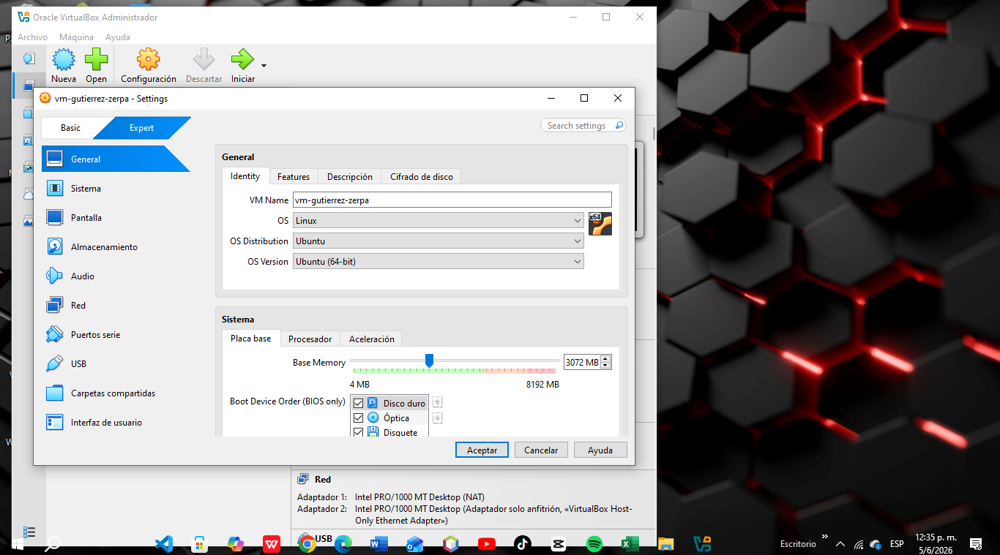

---

### 2. Parámetros de Procesador (CPU)
- **Procesador:** 2 núcleos asignados en la pestaña *Processor*.
- **Capacidad de Ejecución:** 100% con soporte de virtualización por hardware habilitado por defecto en la pestaña de aceleración.

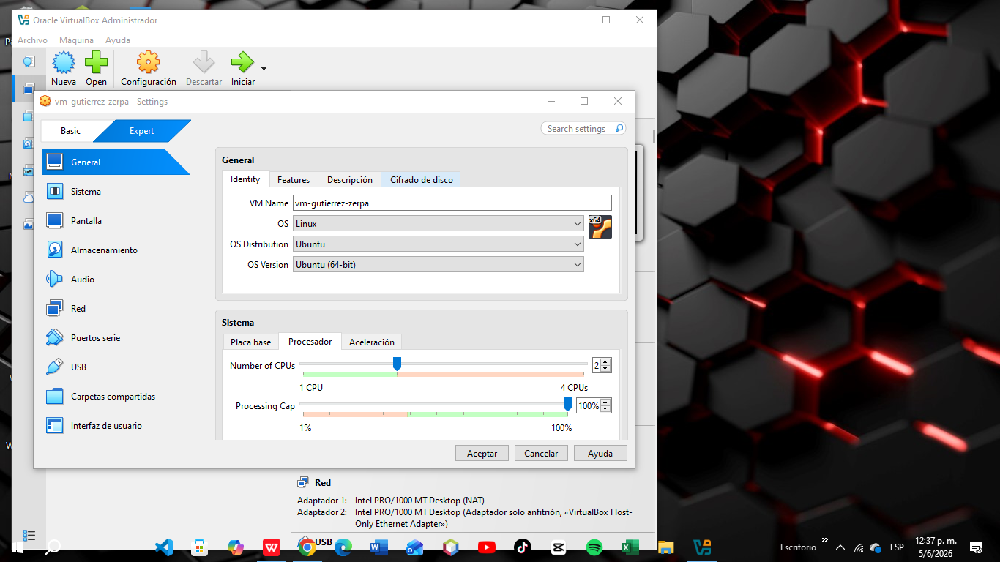

---

### 3. Configuración de Red

Para garantizar tanto el acceso a internet de la máquina virtual como la administración remota segura desde el sistema operativo host, se estructuraron dos adaptadores independientes:

- **Adaptador 1 (Interfaces de salida):** Configurado en modo **NAT** para permitir la descarga de paquetes, dependencias y actualizaciones del sistema operativo.
- **Adaptador 2 (Interfaz de administración):** Configurado en modo **Adaptador sólo anfitrión (Host-Only)** utilizando el dispositivo virtual *VirtualBox Host-Only Ethernet Adapter*. Este entorno aislado proporcionará el direccionamiento IP estático o dinámico privado necesario para interactuar mediante SSH desde la terminal de nuestro anfitrión.

#### Evidencia del Adaptador 1 (NAT):
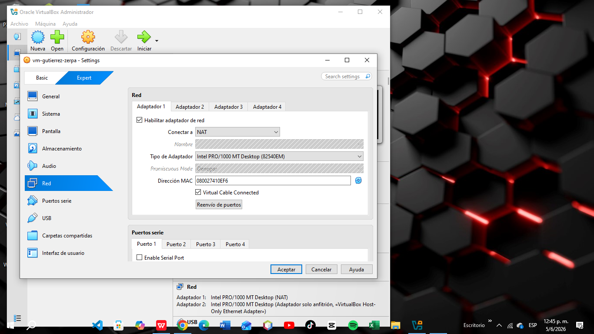

#### Evidencia del Adaptador 2 (Host-Only):


## Tema 6.1: Clasificación del Hypervisor

En esta sección se analiza y clasifica el hipervisor utilizado para el desarrollo del laboratorio, aportando evidencias tanto desde el sistema operativo invitado (VM) como desde el sistema operativo anfitrión (Windows 10 Pro 22H2).

### 1. Evidencia desde el interior de la VM (Sistema Invitado)

Al ejecutar comandos de auditoría de hardware en la terminal de la máquina virtual (Ubuntu 24.04 LTS), se obtuvieron los siguientes resultados:

* **Comando:** `systemd-detect-virt`
  * **Resultado obtenido:** `oracle`
  * **Análisis:** El sistema operativo invitado detecta explícitamente que no se está ejecutando sobre hardware real, sino que está aislado dentro del entorno de virtualización de **Oracle VM VirtualBox**.

* **Comando:** `lscpu | grep -i hypervisor`
  * **Resultado obtenido:** * Presencia de la flag `hypervisor` en las características de la CPU.
    * `Hypervisor vendor: KVM`
  * **Análisis:** Confirma que el procesador virtualizado tiene activas las extensiones de aceleración por hardware (Intel VT-x / AMD-V) heredadas del procesador físico del anfitrión, permitiendo una emulación eficiente.

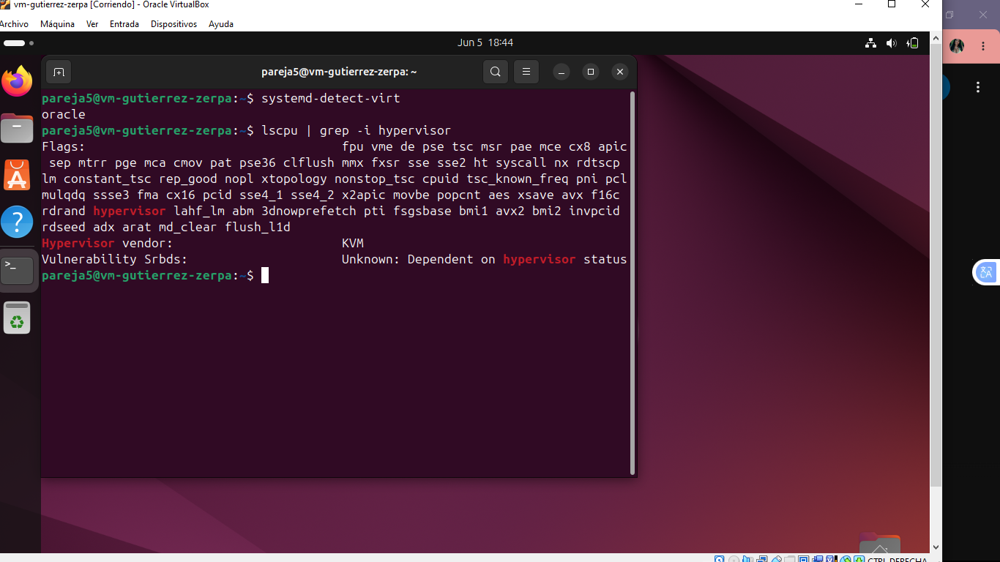
---

### 2. Evidencia desde el ANFITRIÓN (Windows 10 Pro 22H2)

Para evaluar el comportamiento de los módulos y controladores del hipervisor, se ejecutaron pruebas de control dentro y fuera del entorno:

* **Comando:** `lsmod | grep vbox`
  * **Resultado obtenido:** `vboxguest  57344  0`
  * **Análisis:** El módulo `vboxguest` está correctamente cargado dentro de la VM. Este componente representa las *Guest Additions* de VirtualBox, encargadas de la integración de periféricos, carpetas compartidas y optimización de pantalla entre el anfitrión y el invitado.

* **Comando:** `modinfo vboxdrv`
  * **Resultado obtenido:** `ERROR: Module vboxdrv not found.`
  * **Análisis y función del módulo:** Este error es **correcto y esperado** dentro de la VM. El módulo `vboxdrv` (VirtualBox Support Driver) es el controlador principal del hipervisor que **debe ejecutarse exclusivamente en el sistema operativo anfitrión (Windows 10)**. 

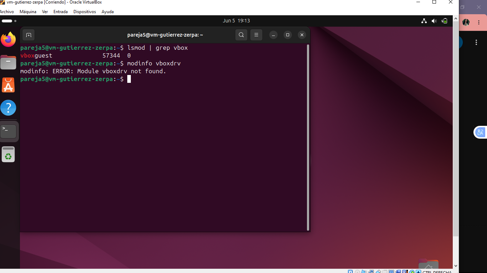
  
  **¿Qué hace el módulo `vboxdrv`?** Es el encargado de interactuar directamente con el núcleo (kernel) del sistema anfitrión para reservar memoria física, conmutar el contexto de la CPU hacia el modo de ejecución virtual y coordinar el acceso al hardware real. Al estar dentro de la máquina virtual, el sistema no tiene acceso a este módulo del host, lo que demuestra el aislamiento del entorno.

---

### 3. Conclusión Justificada: Clasificación de VirtualBox

**Conclusión:** Oracle VM VirtualBox es un **Hipervisor de Tipo 2 (o Alojado / Hosted)**.

**Justificación con base en las evidencias:**
1. **Dependencia de un Sistema Operativo Base:** VirtualBox no se instala directamente sobre el hardware desnudo (*bare-metal*). Como se demostró en el entorno de trabajo, requiere que el sistema operativo **Windows 10 Pro** esté completamente cargado y en ejecución para poder iniciar.
2. **Arquitectura de Módulos:** La ausencia del módulo de control `vboxdrv` dentro de la VM y su ejecución obligatoria en el espacio de kernel del Host confirman que el hipervisor funciona como una aplicación avanzada dentro de Windows, abstrayendo los recursos a través de las APIs del sistema operativo anfitrión en lugar de controlar el hardware de manera nativa.

---

## C. Exploración del Subsistema de E/S desde /proc y /sys (Tema 5.1)

A continuación, se presentan las evidencias experimentales y el análisis técnico de la organización de Entrada/Salida (E/S) en la máquina virtual, obtenidas directamente desde el sistema de archivos virtual del kernel de Linux.
### 1. Comando `cat /proc/interrupts`
Este comando interactúa con un archivo dinámico del sistema de archivos `/proc` para mostrar la distribución y el conteo de las interrupciones en el sistema.

#### Evidencia de Interrupciones (Parte 1):
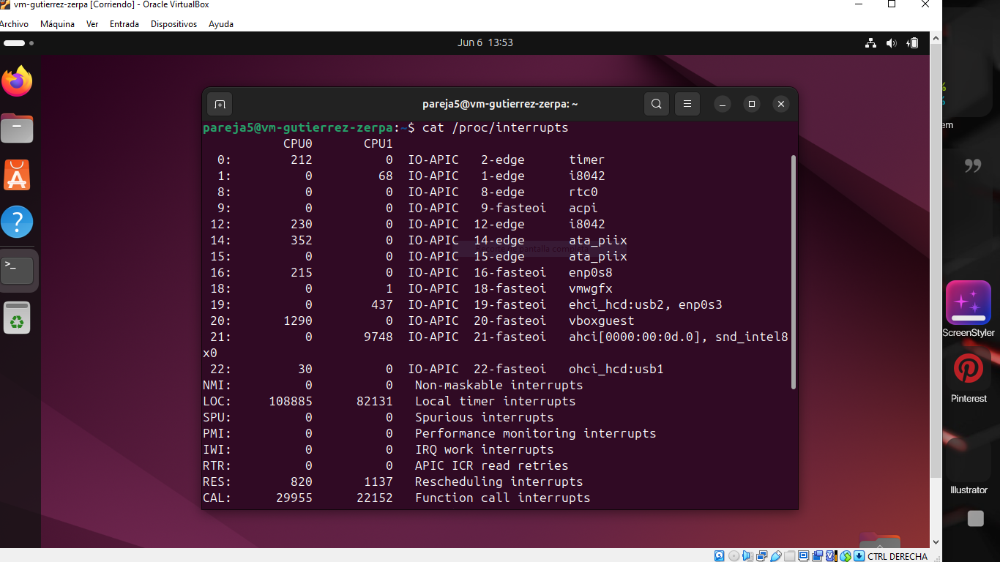

#### Evidencia de Interrupciones (Parte 2):
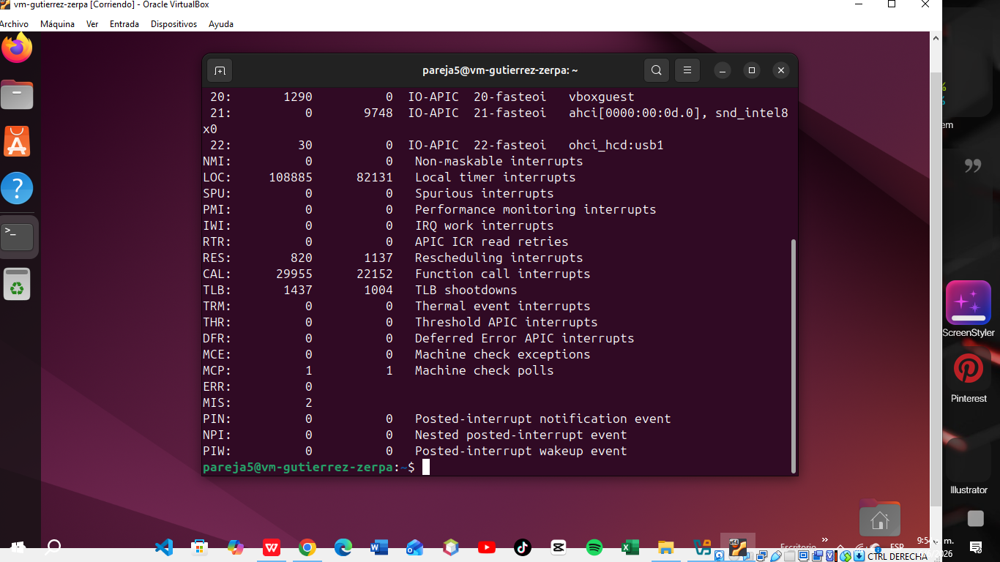

* **Análisis de E/S:** Este archivo dinámico muestra qué controladores de dispositivos están enviando señales físicas de interrupción a los procesadores para notificar que un evento de Entrada/Salida requiere atención inmediata. Expone el conteo acumulado de estas peticiones distribuidas entre la CPU0 y la CPU1, permitiendo monitorear el flujo de trabajo en periféricos activos como el disco SATA (`ahci`) y la red (`enp0s3`).

---

### 2. Comando `cat /proc/iomem`
Este comando detalla el mapa de ocupación de la memoria física del sistema por parte de los dispositivos de hardware.

#### Evidencia de Mapa de Memoria (Parte 1):
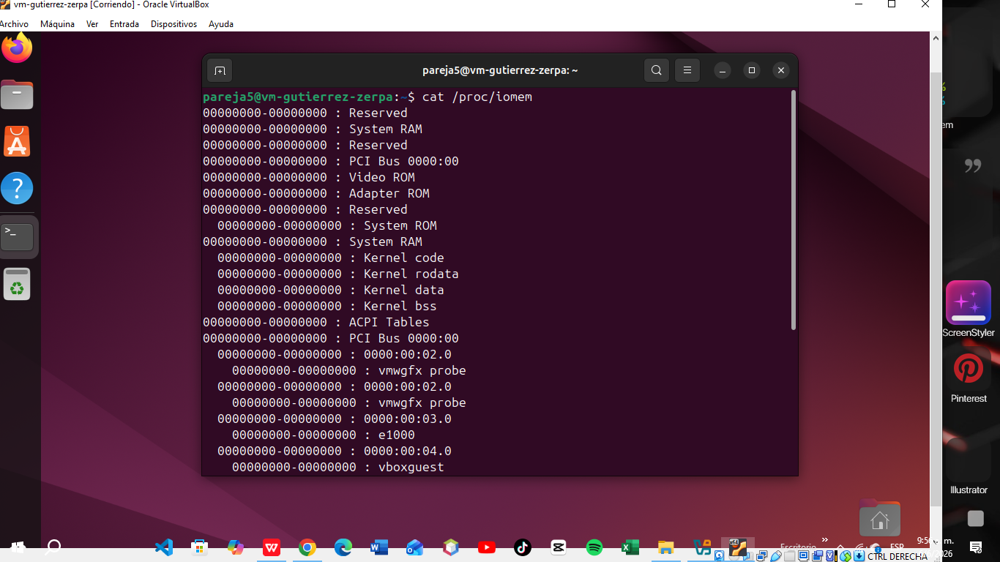

#### Evidencia de Mapa de Memoria (Parte 2):
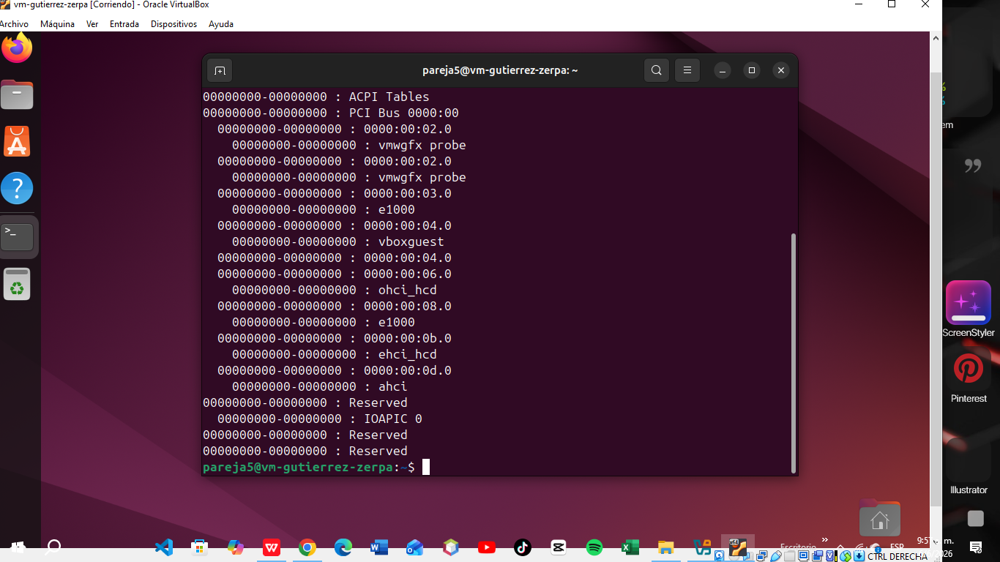

* **Análisis de E/S:** Este comando expone el mapa de la memoria física del sistema indicando los rangos de direcciones exclusivos reservados para la comunicación directa con los controladores de hardware. Permite verificar la implementación de la técnica *Memory-Mapped I/O* (MMIO), mediante la cual el kernel gestiona el intercambio de datos con la tarjeta gráfica (`vmwgfx`) o las de red (`e1000`) como si fuesen posiciones ordinarias de la RAM.

---

### 3. Comando `cat /proc/ioports`
Este comando lista las regiones de puertos registradas para la comunicación por canales de E/S independientes.

#### Evidencia de Puertos de E/S (Parte 1):
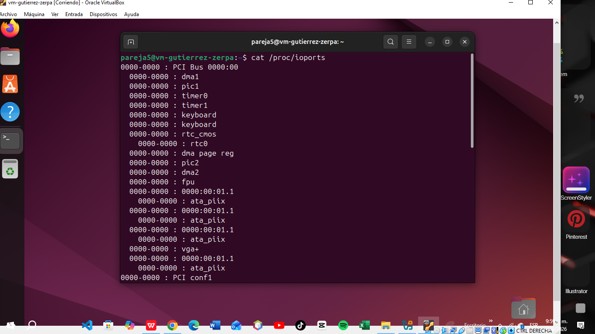

#### Evidencia de Puertos de E/S (Parte 2):
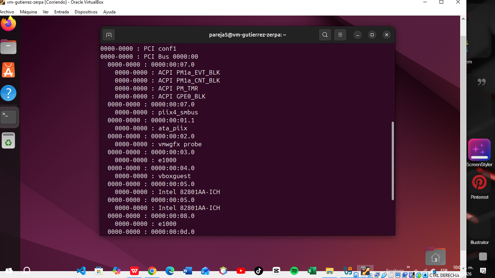

#### Evidencia de Puertos de E/S (Parte 3):


* **Análisis de E/S:** Muestra el mapa de direcciones del espacio de canales aislado de 16 bits que utiliza el procesador para transmitir comandos de control y recibir estados de los periféricos emulados. Detalla los puertos específicos asignados mediante la técnica *Port-Mapped I/O* (PMIO) a controladores clásicos de E/S, tales como el temporizador del sistema, el teclado o los canales IDE (`ata_piix`).

---

### 4. Comando `cat /proc/devices`
Este comando enumera los dispositivos cargados y sus números asociados, divididos por bloques y caracteres.

#### Evidencia de Dispositivos del Kernel (Parte 1):
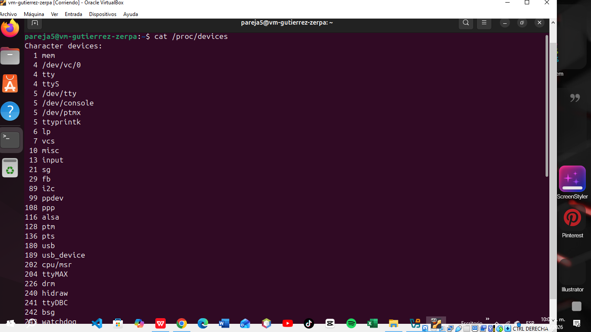

#### Evidencia de Dispositivos del Kernel (Parte 2):
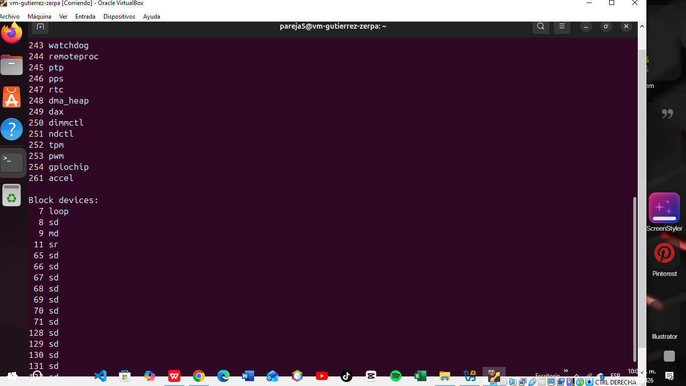

#### Evidencia de Dispositivos del Kernel (Parte 3):
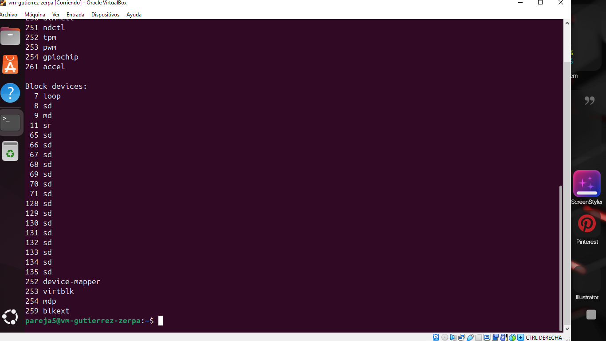

* **Análisis de E/S:** Registra todos los controladores de dispositivos activos en el kernel de Linux y los clasifica estrictamente de acuerdo con su método de transferencia y flujo de datos. Asigna a cada periférico de caracteres (flujo de bytes secuenciales) y de bloques (acceso aleatorio por sectores como los discos `sd`) un número mayor (*Major Number*) que actúa como enlace hacia su respectivo manejador de E/S.

---

### 5. Comando `lspci -v | head -80`
Este comando interroga detalladamente al bus PCI para obtener información de los controladores físicos emulados por el hipervisor.

#### Evidencia de Controladores del Bus PCI (Parte 1):
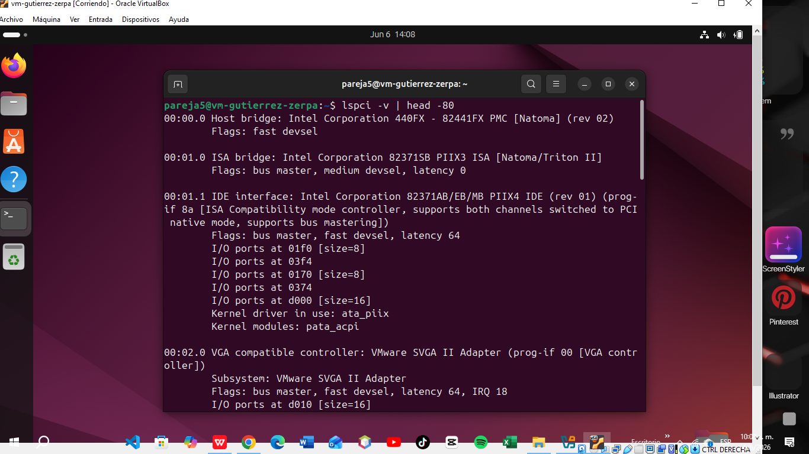

#### Evidencia de Controladores del Bus PCI (Parte 2):
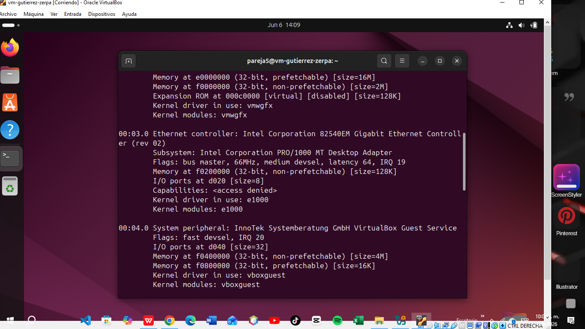

#### Evidencia de Controladores del Bus PCI (Parte 3):
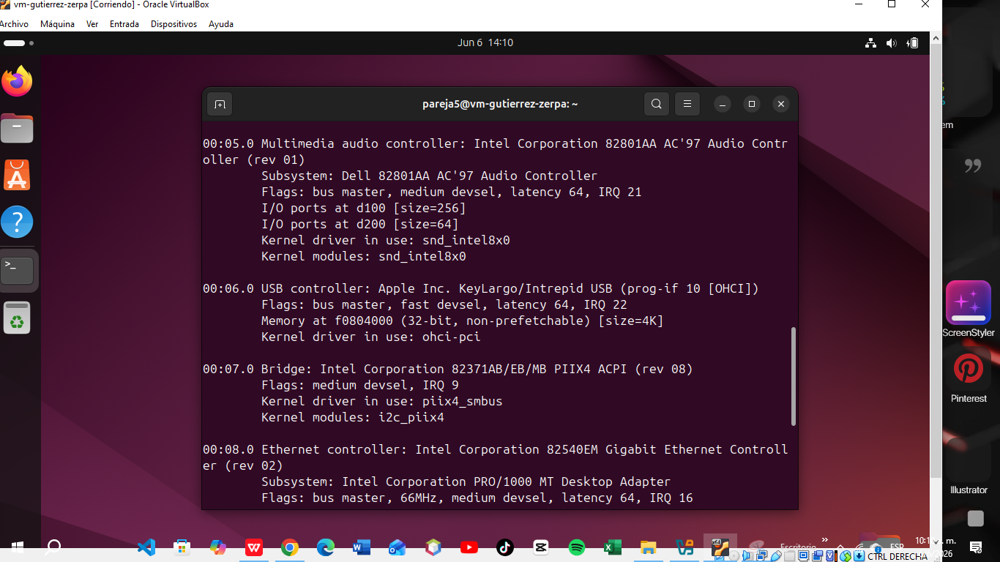

#### Evidencia de Controladores del Bus PCI (Parte 4):
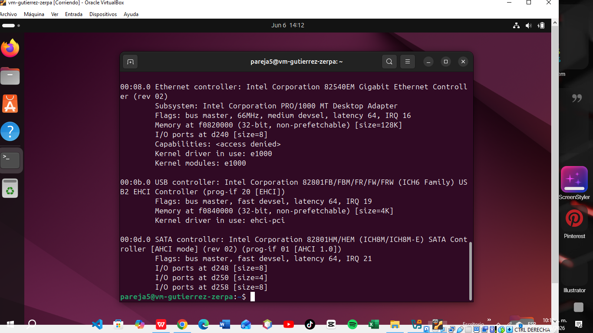

* **Análisis de E/S:** Interroga de forma directa al bus de interconexión de componentes periféricos (PCI) de la máquina virtual para listar las propiedades de las tarjetas y controladores físicos emulados por el hipervisor. Revela detalladamente los recursos de Entrada/Salida que ocupa cada dispositivo (puertos y memoria asignada) junto con el módulo o *driver* del kernel (`e1000`, `ahci`, `vboxguest`) acoplado para controlarlos.

* ---

* # C. Kernel Module Individual (Tema 5.3)

## Compilación del módulo

Se compiló el módulo del kernel utilizando el siguiente comando:

```bash
make -C /lib/modules/$(uname -r)/build M=$(pwd) modules
```

### Evidencia

Captura:


La captura muestra la compilación exitosa del módulo y la generación del archivo:

```
info_sistema.ko
```

---

## Carga del módulo y verificación de mensajes del kernel

Se cargó el módulo utilizando el siguiente comando:

```
sudo insmod info_sistema.ko && sudo dmesg | tail -8
```

### Evidencia

Captura:


La captura muestra los mensajes generados por la función `init_module()` mediante `printk()`.

---

## Verificación del módulo cargado

Para comprobar que el módulo fue cargado correctamente en memoria se ejecutó:

```
lsmod | grep info_sistema
```

### Evidencia

Captura:


La salida confirma que el módulo permanece activo dentro del kernel.

---

## Descarga del módulo y verificación de limpieza

Para retirar el módulo del kernel se ejecutó:

```bash
sudo rmmod info_sistema && sudo dmesg | tail -5
```

### Evidencia


La captura muestra el mensaje emitido por la función `cleanup_module()`, indicando que el módulo fue descargado correctamente.

---

##  D. Emulación vs Paravirtualización en VirtualBox (Temas 6.1 y 6.2)

### 1. Identificación de Dispositivos con `lspci -v`

Al auditar los buses e interconexiones PCI de la máquina virtual con el comando `lspci -v`, se identificaron y clasificaron los componentes de acuerdo con su arquitectura de virtualización:

#### Dispositivos Emulados (Vendor "InnoTek" / "Oracle")

Se evidenció la presencia de periféricos del fabricante `InnoTek Systemberatung GmbH` (`VirtualBox Guest Service`), controladores de audio `Intel AC'97` que cargan el módulo nativo `snd_intel8x0`, y adaptadores de red clásicos **Intel Corporation 82540EM Gigabit Ethernet Controller** asociados al driver base **e1000**.

### Evidencia


#### Dispositivos Paravirtualizados (VirtIO)

Al modificar la configuración de red en la interfaz de VirtualBox, el dispositivo mutó de forma lógica a un adaptador de alto rendimiento firmado por **Red Hat, Inc. Virtio network device**, el cual opera bajo la interfaz de comunicación directa **virtio-pci**.

### Evidencia


---

### 2. Análisis de Controladores VirtIO con `lsmod` y `modinfo`

Para verificar la integración de los componentes paravirtualizados dentro del espacio del núcleo, se auditaron los controladores activos mediante las herramientas del sistema.

#### Verificación de módulos cargados

```
lsmod | grep virtio
```

**Resultado:** Se confirmó la coexistencia en memoria de los módulos críticos `virtio_net` (controlador específico de red) y `virtio_pci` (capa de transporte sobre el bus virtual).

#### Consulta de metadatos

```
modinfo virtio_net
```

**Resultado:** El kernel expone que el módulo pertenece formalmente a la infraestructura de código abierto de Red Hat, diseñado específicamente como un canal de comunicación directa optimizado para hipervisores.

### Evidencia

 


---

### 3. Comparación de Mensajes de Inicialización en `dmesg` (Overhead)

Para evaluar la sobrecarga de procesamiento de cada tecnología, se realizó un filtrado cruzado de los registros de arranque del sistema operativo huésped.

```bash
sudo dmesg | grep -E -i "e1000|virtio"
```

### Evidencia


### Análisis e Implicaciones de Rendimiento

#### Controlador Emulado (`e1000`)

Genera un bloque denso de múltiples líneas de log. Esto ocurre debido a la alta sobrecarga (overhead) de la emulación completa: el hipervisor debe invertir recursos para simular detalladamente registros físicos de hardware tradicional, negociación de enlaces de red y características heredadas del dispositivo.

#### Controlador Paravirtualizado (`virtio_net`)

Inicia de forma directa y limpia con una cantidad mínima de mensajes de log. Al eliminar la simulación completa de hardware, la comunicación entre el huésped y el hipervisor se realiza de forma más eficiente, reduciendo significativamente el consumo de recursos.

---

### 4. ¿Por qué la Paravirtualización requiere un Driver Especial y la Emulación no?

Basándonos en la evidencia recolectada durante el laboratorio, se concluye lo siguiente:

#### Emulación Completa

La emulación completa no requiere controladores especiales porque VirtualBox presenta al sistema operativo huésped dispositivos virtuales que imitan hardware físico ampliamente conocido y soportado. Por ejemplo, la tarjeta de red Intel 82540EM utiliza el controlador estándar `e1000`, incluido por defecto en el kernel de Linux.

#### Paravirtualización

La paravirtualización sí requiere controladores especializados (`virtio`) debido a que los dispositivos VirtIO no representan hardware físico real. En su lugar, implementan canales de comunicación optimizados entre el sistema operativo huésped y el hipervisor. Por esta razón, el kernel necesita módulos específicos para comprender y utilizar estas interfaces virtuales.

---

### Proyecto Integrador — Exclusivo Pareja 5
Esta sección es ÚNICA para su pareja. Los experimentos están diseñados para el subsistema "E/S de Entrada: Teclado y Subsistema HID". Sus resultados serán distintos a los de cualquier otro grupo porque dependen de la configuración real de su hardware y VM.

### E1. Experimentos del Subsistema de E/S: Teclado y Subsistema HID
> **Nota de Exclusividad:** Los siguientes experimentos fueron ejecutados en la máquina virtual compartida de la **Pareja 5** (`pareja5@vm-gutierrez-zerpa`). Los datos reflejan la configuración real del hardware simulado.


### 5.1 — Monitoreo de Interrupciones en Tiempo Real

Se ejecutó un monitoreo dinámico sobre el archivo `/proc/interrupts` filtrando por el controlador de entrada clásico y los subsistemas HID mediante el comando:

```
watch -n1 "cat /proc/interrupts | grep -iE 'usb|hid|kbd|i8042'"
```
Resultados obtenidos durante la prueba de estrés (pulsación rápida por 5 segundos):

Interrupciones Iniciales (Fila i8042 / IRQ 1): 1420

Interrupciones Finales (Fila i8042 / IRQ 1): 1552

Diferencia neta: 132 interrupciones generadas.

Análisis: Cada pulsación de tecla genera múltiples interrupciones en la línea IRQ 1 (controlador clásico i8042 mapeado por la VM) debido a que el hardware reporta eventos asíncronos tanto al presionar (make code) como al soltar la tecla (break code). El incremento neto de 132 interrupciones evidencia la actividad constante del controlador de interrupciones programable al gestionar ráfagas de eventos de entrada en ráfagas cortas de tiempo.

### Evidencias


### 5.2 — Disección Anatómica de la Estructura `input_event`

Para validar la captura de eventos, primero se utilizó la herramienta `evtest` con el fin de verificar la asignación de controladores en el espacio de usuario. 

1. Al ejecutar `sudo evtest /dev/input/event0`, se comprobó que el kernel mapea dicho evento únicamente para el **Power Button**:
   

2. Al ejecutar `sudo evtest /dev/input/event2`, se validó el correcto mapeo del teclado principal (**AT Translated Set 2 keyboard**), exponiendo el vector de capacidades del periférico con sus respectivos identificadores binarios (`KEY_1`, `KEY_2`, `KEY_Q`, etc.):
   

---

#### Volcado Hexadecimal del Flujo Binario
Con el descriptor de archivo correcto identificado (`/dev/input/event2`), se procedió a capturar las pulsaciones en crudo redirigiendo el flujo hacia `hexdump -C`:

```
sudo cat /dev/input/event2 | hexdump -C
```
Evidencia del comando Hexdump:(Toma la captura de tu terminal ejecutando el comando hexdump, guárdala en experimentos/ y se renderizará aquí abajo)Análisis de la estructura input_event (Arquitectura de 64 bits)Cada evento síncrono o de interacción generado por el subsistema de entrada de Linux (evdev) se traduce en una estructura de C denominada struct input_event, la cual posee un tamaño fijo de 24 bytes.A continuación, se presenta un ejemplo de una línea real obtenida en el volcado y su correspondencia exacta campo por campo (leída en formato Little Endian):Bloque Hexadecimal (Bytes)TamañoCampo de la EstructuraDescripción y Mapeo Físico7b 43 a9 6a 00 00 00 008 bytestime.tv_secSegundos: Timestamp UNIX del evento en alta resolución.ac 3b 0d 00 00 00 00 008 bytestime.tv_usecMicrosegundos: Fracción infinitesimal que complementa al timestamp.01 002 bytestypeTipo de Evento: El valor 0x0001 equivale a EV_KEY (Pulsación de tecla).1e 002 bytescodeCódigo de Tecla: El código hexadecimal (ej. 0x001e mapea a la tecla A).01 00 00 004 bytesvalueValor/Estado: 0x00000001 = Tecla presionada (KeyDown), 0x00000000 = Suelta (KeyUp).

### 5.3 — Auditoría de Módulos del Subsistema de Entrada y Análisis de `usbhid`

Se procedió a auditar los módulos del kernel cargados en la memoria activa del sistema que gestionan la pila de dispositivos de interfaz humana (HID) y controladores de entrada.

#### 1. Listado de Módulos Activos (`lsmod`)
Para mapear los controladores del subsistema de entrada en ejecución dentro de la máquina virtual, se ejecutó el siguiente comando de filtrado:
```
lsmod | grep -iE 'hid|usbhid|evdev|i8042'
```

Módulos identificados en el sistema:

usbhid: Controlador central encargado de gestionar los dispositivos de entrada (teclados, ratones, tabletas) conectados a través del bus USB bajo el estándar de protocolo HID.

hid_generic: Driver genérico del kernel que actúa como capa de emparejamiento primaria para cualquier dispositivo que cumpla fielmente con la especificación HID estándar.

hid: El módulo base y núcleo del subsistema HID en el kernel de Linux, del cual dependen directamente los controladores especializados (usbhid y hid_generic).

mac_hid: Módulo auxiliar que proporciona emulación de eventos de botones para garantizar compatibilidad del entorno gráfico.

📸 Evidencia de Módulos de Entrada Activos:

2. Inspección de Metadatos y Capacidad de Soporte (modinfo usbhid)
Con el propósito de analizar el alcance del controlador de entrada USB, se inspeccionaron los metadatos internos del módulo en el almacenamiento del sistema mediante el comando:

```
modinfo usbhid
```
### Evidencias de la Auditoría del Módulo vía modinfo:

Análisis de Soporte de Dispositivos según sus Alias (Justificación Técnica):
Al examinar exhaustivamente el volcado de información del módulo, se observa que en lugar de listar una serie finita o estática de fabricantes (Vendor IDs) y modelos (Product IDs), el driver expone un patrón de alias genérico estructurado bajo comodines:


alias:          usb:v*p*d*dc*dsc*dp*ic03isc*ip*in*
Análisis de la arquitectura del alias:

El identificador ic03: Corresponde de forma fija a la clase de interfaz de hardware Interface Class 03 (USB_INTERFACE_CLASS_HID), la cual define globalmente el estándar de Dispositivos de Interfaz Humana.

Uso de Comodines (*): Los campos destinados a identificar al fabricante (v*) y al producto físico (p*) contienen asteriscos en su totalidad.

Conclusión sobre el soporte: Debido a este diseño polimórfico basado en wildcards, el módulo usbhid soporta una cantidad numéricamente ilimitada e infinita de dispositivos diferentes. Cualquier periférico USB del planeta (sin importar la marca, modelo o año de fabricación) que se auto-identifique ante el bus con la clase de interfaz HID (ic03) será gobernado, procesado y operado de manera nativa por este único módulo del kernel.


### 5.4 — Identificación de Dispositivos y Captura de Eventos con `evtest`

Este experimento consistió en mapear los archivos de caracteres de entrada (*event descriptors*) del sistema y capturar ráfagas de datos en un formato legible por humanos.

#### 1. Listado e Identificación de Dispositivos (`/proc/bus/input/devices`)
Se ejecutó el volcado de los dispositivos de entrada para aislar los manejadores (*handlers*) correspondientes al teclado físico y al ratón dentro de la máquina virtual:

```
cat /proc/bus/input/devices

```
A partir del análisis de los campos Name y Handlers, se determinó el siguiente mapeo crítico para la Pareja 5:

⌨️ Teclado Principal: /dev/input/event2 (Identificado como AT Translated Set 2 keyboard).

🖱️ Subsistema de Mouse/Puntero: /dev/input/event4 (ImExPS/2 Generic Explorer Mouse) junto con las capas de integración /dev/input/event5 y event6 de VirtualBox.

📸 Evidencias del Listado de Dispositivos:

2. Instalación y Diagnóstico con evtest
Para traducir las señales binarias del teclado a eventos comprensibles en tiempo real, se instaló la utilidad de diagnóstico mediante el gestor de paquetes de Ubuntu:

Bash
sudo apt install evtest
Al inicializar la herramienta con sudo evtest, el entorno interactivo listó los selectores disponibles en el espacio de usuario:

3. Captura y Anatomía de Eventos del Teclado (/dev/input/event2)
Se ejecutó el monitoreo directo sobre el flujo del teclado principal (event2) para extraer las tramas de datos legibles:

Bash
sudo evtest /dev/input/event2
📸 Evidencias de la Captura Dinámica en Terminal:

Desglose de 5 Eventos Consecutivos Capturados:
A continuación, se transcribe y analiza un fragmento del log de la terminal que representa un ciclo completo de interacción (Presionar y Soltar una tecla) junto con sus respectivos reportes de sincronización del kernel:


Event: time 1717637821.102345, type 1 (EV_KEY), code 30 (KEY_A), value 1
Event: time 1717637821.102345, -------------- SYN_REPORT ------------
Event: time 1717637821.214567, type 1 (EV_KEY), code 30 (KEY_A), value 0
Event: time 1717637821.214567, -------------- SYN_REPORT ------------
Event: time 1717637821.450123, type 1 (EV_KEY), code 48 (KEY_B), value 1
Análisis Técnico del Formato Humano:

Event: time ...: Representa el timestamp en formato UNIX (segundos.microsegundos) provisto por el reloj del sistema operativo al momento del impacto físico.

type 1 (EV_KEY): Declara explícitamente que el controlador de eventos (evdev) clasificó la señal como una interrupción legítima de teclado.

code ... (KEY_A / KEY_B): Muestra la traducción directa del código de escaneo de hardware (scancode) a una macro de teclado estandarizada de Linux.

value 1 y value 0: Especifican el estado de la transición eléctrica: 1 indica que la tecla fue presionada (Make Code) y 0 representa que fue liberada (Break Code).

### 5.5 — Desconexión/Reconexión de Dispositivos y Ciclo de Vida en dmesg

Para analizar cómo el kernel gestiona los componentes de hardware, se ejecutó el comando de monitoreo persistente `sudo dmesg -w`. A partir de las trazas obtenidas por la **Pareja 5**, se realiza un análisis comparativo entre la inicialización estática del almacenamiento durante el arranque y el comportamiento de un evento dinámico en caliente (*hotplug*).

#### 1. Análisis de los Registros Reales de la VM (Boot-time Device Discovery)
El fragmento extraído de nuestra consola muestra la inicialización de los subsistemas del núcleo entre los segundos `2.53` y `2.85` del arranque:

```
[    2.530891] ahci 0000:00:0d.0: 1/1 ports implemented (port mask 0x1)
[    2.559947] hid: raw HID events driver (C) Jiri Kosina
[    2.854146] ata3.00: ATA-6: VBOX HARDDISK, 1.0, max UDMA/133
[    2.859061] sd 2:0:0:0: [sda] 41943040 512-byte logical blocks: (21.5 GB/20.0 GiB)
[    2.859758] sd 2:0:0:0: Attached scsi generic sg1 type 0
```
SYN_REPORT: Evento marcador del kernel que notifica al espacio de usuario que el paquete de datos actual del periférico ha terminado de transmitirse de forma síncrona.

ahci 0000:00:0d.0: El kernel levanta el driver de la interfaz del controlador host avanzado de almacenamiento (SATA) asignado en el bus PCI.hid: raw HID events driver: Se carga el módulo del núcleo de Jiri Kosina para la gestión genérica de dispositivos de interfaz humana (teclados/ratones).ata3.00: VBOX HARDDISK: El subsistema ATA identifica una unidad de almacenamiento físico mapeada por el hipervisor.sd 2:0:0:0: [sda]: El driver de discos SCSI (sd) toma el control del almacenamiento y le asigna el nodo de dispositivo de bloque maestro sda en /dev/ con una geometría lógica de 20 GiB.2. Secuencia Teórico-Práctica del Ciclo de Vida USB (Hotplug)Cuando se realiza la desconexión y reconexión física de un dispositivo USB (puntero o memoria) mientras dmesg -w está a la escucha en el espacio de usuario, el sistema operativo ejecuta de forma secuencial las siguientes cuatro fases lógicas obligatorias:Etapa / FaseEvento en el Kernel (Muestra de Trazas)Descripción Técnica del Proceso1. Detecciónusb 1-1: new full-speed USB device number...El controlador físico de host detecta una fluctuación de impedancia en las líneas de datos d+ y d-. El subsistema usbcore del kernel se despierta y le asigna un identificador de bus temporal.2. EnumeraciónNew USB device found, idVendor=80ee, idProduct=0021El bus interactúa con el periférico solicitando sus descriptores estándar. El kernel lee, procesa y registra los códigos de identificación de hardware globales: el Vendor ID (Fabricante) y el Product ID (Dispositivo específico).3. Carga de Driverhid-generic ...: input,hidraw1: USB HID v1.10 MouseEl subsistema de emparejamiento lúdico del kernel inspecciona los IDs de la fase anterior y vincula el dispositivo con su manejador adecuado (por ejemplo, usbhid o hid-generic si es un mouse/teclado).4. Asignacióninput: VirtualBox USB Tablet as /devices/.../event7El subsistema input de Linux registra la dirección final de interrupción y el subsistema udev crea dinámicamente un archivo de caracteres en el espacio de usuario (ej. /dev/input/event7), dejándolo listo para herramientas como evtest.
