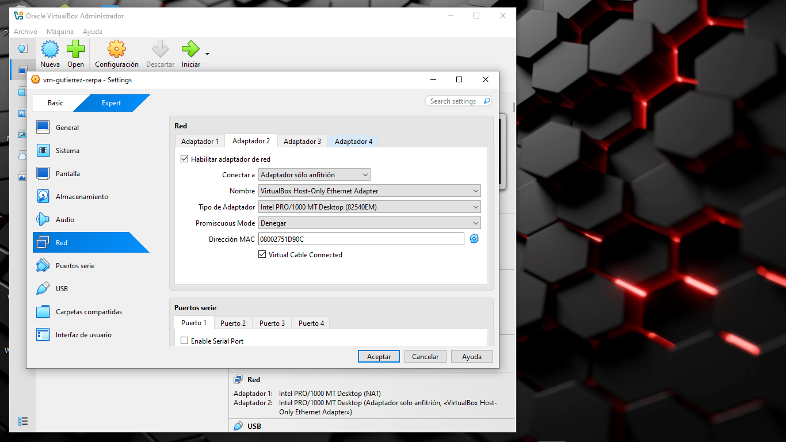

# Reporte de Laboratorio: Fase 1 (Temas 5.1 y 6.1)

**Integrantes:** [Yenifer Gutierrez] y [Jose Zerpa]  
**Fecha:** 5 de Junio, 2026

**Identificación de la VM:** vm-gutierrez-zerpa  

---

## A. Preparación de la VM

La máquina virtual ha sido configurada y verificada con los parámetros técnicos solicitados para el correcto desarrollo de las fases posteriores del laboratorio.

### 1. Parámetros de Sistema (Memoria y Sistema Operativo)
- **Sistema Operativo:** Ubuntu 24.04.4 LTS Desktop (64-bit)
- **Memoria RAM:** 3072 MB (3 GB asignados, superando el mínimo requerido de 2 GB para mitigar problemas de *thrashing*).


---

### 2. Parámetros de Procesador (CPU)
- **Procesador:** 2 núcleos asignados en la pestaña *Processor*.
- **Capacidad de Ejecución:** 100% con soporte de virtualización por hardware habilitado por defecto en la pestaña de aceleración.


---

### 3. Configuración de Red

Para garantizar tanto el acceso a internet de la máquina virtual como la administración remota segura desde el sistema operativo host, se estructuraron dos adaptadores independientes:

- **Adaptador 1 (Interfaces de salida):** Configurado en modo **NAT** para permitir la descarga de paquetes, dependencias y actualizaciones del sistema operativo.
- **Adaptador 2 (Interfaz de administración):** Configurado en modo **Adaptador sólo anfitrión (Host-Only)** utilizando el dispositivo virtual *VirtualBox Host-Only Ethernet Adapter*. Este entorno aislado proporcionará el direccionamiento IP estático o dinámico privado necesario para interactuar mediante SSH desde la terminal de nuestro anfitrión.

#### Evidencia del Adaptador 1 (NAT):


#### Evidencia del Adaptador 2 (Host-Only):


## Tema 6.1: Clasificación del Hypervisor

En esta sección se analiza y clasifica el hipervisor utilizado para el desarrollo del laboratorio, aportando evidencias tanto desde el sistema operativo invitado (VM) como desde el sistema operativo anfitrión (Windows 10 Pro 22H2).

### 1. Evidencia desde el interior de la VM (Sistema Invitado)

Al ejecutar comandos de auditoría de hardware en la terminal de la máquina virtual (Ubuntu 24.04 LTS), se obtuvieron los siguientes resultados:

* **Comando:** `systemd-detect-virt`
  * **Resultado obtenido:** `oracle`
  * **Análisis:** El sistema operativo invitado detecta explícitamente que no se está ejecutando sobre hardware real, sino que está aislado dentro del entorno de virtualización de **Oracle VM VirtualBox**.

* **Comando:** `lscpu | grep -i hypervisor`
  * **Resultado obtenido:** * Presencia de la flag `hypervisor` en las características de la CPU.
    * `Hypervisor vendor: KVM`
  * **Análisis:** Confirma que el procesador virtualizado tiene activas las extensiones de aceleración por hardware (Intel VT-x / AMD-V) heredadas del procesador físico del anfitrión, permitiendo una emulación eficiente.


---

### 2. Evidencia desde el ANFITRIÓN (Windows 10 Pro 22H2)

Para evaluar el comportamiento de los módulos y controladores del hipervisor, se ejecutaron pruebas de control dentro y fuera del entorno:

* **Comando:** `lsmod | grep vbox`
  * **Resultado obtenido:** `vboxguest  57344  0`
  * **Análisis:** El módulo `vboxguest` está correctamente cargado dentro de la VM. Este componente representa las *Guest Additions* de VirtualBox, encargadas de la integración de periféricos, carpetas compartidas y optimización de pantalla entre el anfitrión y el invitado.

* **Comando:** `modinfo vboxdrv`
  * **Resultado obtenido:** `ERROR: Module vboxdrv not found.`
  * **Análisis y función del módulo:** Este error es **correcto y esperado** dentro de la VM. El módulo `vboxdrv` (VirtualBox Support Driver) es el controlador principal del hipervisor que **debe ejecutarse exclusivamente en el sistema operativo anfitrión (Windows 10)**. 


  
  **¿Qué hace el módulo `vboxdrv`?** Es el encargado de interactuar directamente con el núcleo (kernel) del sistema anfitrión para reservar memoria física, conmutar el contexto de la CPU hacia el modo de ejecución virtual y coordinar el acceso al hardware real. Al estar dentro de la máquina virtual, el sistema no tiene acceso a este módulo del host, lo que demuestra el aislamiento del entorno.

---

### 3. Conclusión Justificada: Clasificación de VirtualBox

**Conclusión:** Oracle VM VirtualBox es un **Hipervisor de Tipo 2 (o Alojado / Hosted)**.

**Justificación con base en las evidencias:**
1. **Dependencia de un Sistema Operativo Base:** VirtualBox no se instala directamente sobre el hardware desnudo (*bare-metal*). Como se demostró en el entorno de trabajo, requiere que el sistema operativo **Windows 10 Pro** esté completamente cargado y en ejecución para poder iniciar.
2. **Arquitectura de Módulos:** La ausencia del módulo de control `vboxdrv` dentro de la VM y su ejecución obligatoria en el espacio de kernel del Host confirman que el hipervisor funciona como una aplicación avanzada dentro de Windows, abstrayendo los recursos a través de las APIs del sistema operativo anfitrión en lugar de controlar el hardware de manera nativa.

---

## C. Exploración del Subsistema de E/S desde /proc y /sys (Tema 5.1)

A continuación, se presentan las evidencias experimentales y el análisis técnico de la organización de Entrada/Salida (E/S) en la máquina virtual, obtenidas directamente desde el sistema de archivos virtual del kernel de Linux.
### 1. Comando `cat /proc/interrupts`
Este comando interactúa con un archivo dinámico del sistema de archivos `/proc` para mostrar la distribución y el conteo de las interrupciones en el sistema.

#### Evidencia de Interrupciones (Parte 1):


#### Evidencia de Interrupciones (Parte 2):


* **Análisis de E/S:** Este archivo dinámico muestra qué controladores de dispositivos están enviando señales físicas de interrupción a los procesadores para notificar que un evento de Entrada/Salida requiere atención inmediata. Expone el conteo acumulado de estas peticiones distribuidas entre la CPU0 y la CPU1, permitiendo monitorear el flujo de trabajo en periféricos activos como el disco SATA (`ahci`) y la red (`enp0s3`).

---

### 2. Comando `cat /proc/iomem`
Este comando detalla el mapa de ocupación de la memoria física del sistema por parte de los dispositivos de hardware.

#### Evidencia de Mapa de Memoria (Parte 1):


#### Evidencia de Mapa de Memoria (Parte 2):


* **Análisis de E/S:** Este comando expone el mapa de la memoria física del sistema indicando los rangos de direcciones exclusivos reservados para la comunicación directa con los controladores de hardware. Permite verificar la implementación de la técnica *Memory-Mapped I/O* (MMIO), mediante la cual el kernel gestiona el intercambio de datos con la tarjeta gráfica (`vmwgfx`) o las de red (`e1000`) como si fuesen posiciones ordinarias de la RAM.

---

### 3. Comando `cat /proc/ioports`
Este comando lista las regiones de puertos registradas para la comunicación por canales de E/S independientes.

#### Evidencia de Puertos de E/S (Parte 1):


#### Evidencia de Puertos de E/S (Parte 2):


#### Evidencia de Puertos de E/S (Parte 3):


* **Análisis de E/S:** Muestra el mapa de direcciones del espacio de canales aislado de 16 bits que utiliza el procesador para transmitir comandos de control y recibir estados de los periféricos emulados. Detalla los puertos específicos asignados mediante la técnica *Port-Mapped I/O* (PMIO) a controladores clásicos de E/S, tales como el temporizador del sistema, el teclado o los canales IDE (`ata_piix`).

---

### 4. Comando `cat /proc/devices`
Este comando enumera los dispositivos cargados y sus números asociados, divididos por bloques y caracteres.

#### Evidencia de Dispositivos del Kernel (Parte 1):


#### Evidencia de Dispositivos del Kernel (Parte 2):


#### Evidencia de Dispositivos del Kernel (Parte 3):


* **Análisis de E/S:** Registra todos los controladores de dispositivos activos en el kernel de Linux y los clasifica estrictamente de acuerdo con su método de transferencia y flujo de datos. Asigna a cada periférico de caracteres (flujo de bytes secuenciales) y de bloques (acceso aleatorio por sectores como los discos `sd`) un número mayor (*Major Number*) que actúa como enlace hacia su respectivo manejador de E/S.

---

### 5. Comando `lspci -v | head -80`
Este comando interroga detalladamente al bus PCI para obtener información de los controladores físicos emulados por el hipervisor.

#### Evidencia de Controladores del Bus PCI (Parte 1):


#### Evidencia de Controladores del Bus PCI (Parte 2):


#### Evidencia de Controladores del Bus PCI (Parte 3):


#### Evidencia de Controladores del Bus PCI (Parte 4):


* **Análisis de E/S:** Interroga de forma directa al bus de interconexión de componentes periféricos (PCI) de la máquina virtual para listar las propiedades de las tarjetas y controladores físicos emulados por el hipervisor. Revela detalladamente los recursos de Entrada/Salida que ocupa cada dispositivo (puertos y memoria asignada) junto con el módulo o *driver* del kernel (`e1000`, `ahci`, `vboxguest`) acoplado para controlarlos.

* ---

* # C. Kernel Module Individual (Tema 5.3)

## Compilación del módulo

Se compiló el módulo del kernel utilizando el siguiente comando:

```bash
make -C /lib/modules/$(uname -r)/build M=$(pwd) modules
```

### Evidencia

Captura:

```text
/capturas/compilacion_exitosa.jpg
```

La captura muestra la compilación exitosa del módulo y la generación del archivo:

```text
info_sistema.ko
```

---

## Carga del módulo y verificación de mensajes del kernel

Se cargó el módulo utilizando el siguiente comando:

```bash
sudo insmod info_sistema.ko && sudo dmesg | tail -8
```

### Evidencia

Captura:

```text
/capturas/carga_modulo_dmesg.jpg
```

La captura muestra los mensajes generados por la función `init_module()` mediante `printk()`.

---

## Verificación del módulo cargado

Para comprobar que el módulo fue cargado correctamente en memoria se ejecutó:

```bash
lsmod | grep info_sistema
```

### Evidencia

Captura:

```text
/capturas/verificacion_lsmod.jpg
```

La salida confirma que el módulo permanece activo dentro del kernel.

---

## Descarga del módulo y verificación de limpieza

Para retirar el módulo del kernel se ejecutó:

```bash
sudo rmmod info_sistema && sudo dmesg | tail -5
```

### Evidencia

Captura:

```text
/capturas/modulo_descargado_cleanup.jpg
```

La captura muestra el mensaje emitido por la función `cleanup_module()`, indicando que el módulo fue descargado correctamente.

---

##  D. Emulación vs Paravirtualización en VirtualBox (Temas 6.1 y 6.2)

### 1. Identificación de Dispositivos con `lspci -v`

Al auditar los buses e interconexiones PCI de la máquina virtual con el comando `lspci -v`, se identificaron y clasificaron los componentes de acuerdo con su arquitectura de virtualización:

#### Dispositivos Emulados (Vendor "InnoTek" / "Oracle")

Se evidenció la presencia de periféricos del fabricante `InnoTek Systemberatung GmbH` (`VirtualBox Guest Service`), controladores de audio `Intel AC'97` que cargan el módulo nativo `snd_intel8x0`, y adaptadores de red clásicos **Intel Corporation 82540EM Gigabit Ethernet Controller** asociados al driver base **e1000**.

#### Dispositivos Paravirtualizados (VirtIO)

Al modificar la configuración de red en la interfaz de VirtualBox, el dispositivo mutó de forma lógica a un adaptador de alto rendimiento firmado por **Red Hat, Inc. Virtio network device**, el cual opera bajo la interfaz de comunicación directa **virtio-pci**.

### Evidencia

Agregar captura:

```text
/capturas/lspci_v.jpg
```

---

### 2. Análisis de Controladores VirtIO con `lsmod` y `modinfo`

Para verificar la integración de los componentes paravirtualizados dentro del espacio del núcleo, se auditaron los controladores activos mediante las herramientas del sistema.

#### Verificación de módulos cargados

```bash
lsmod | grep virtio
```

**Resultado:** Se confirmó la coexistencia en memoria de los módulos críticos `virtio_net` (controlador específico de red) y `virtio_pci` (capa de transporte sobre el bus virtual).

#### Consulta de metadatos

```bash
modinfo virtio_net
```

**Resultado:** El kernel expone que el módulo pertenece formalmente a la infraestructura de código abierto de Red Hat, diseñado específicamente como un canal de comunicación directa optimizado para hipervisores.

### Evidencia

Agregar capturas:

```text
/capturas/lsmod_virtio.jpg
/capturas/modinfo_virtio_net.jpg
```

---

### 3. Comparación de Mensajes de Inicialización en `dmesg` (Overhead)

Para evaluar la sobrecarga de procesamiento de cada tecnología, se realizó un filtrado cruzado de los registros de arranque del sistema operativo huésped.

```bash
sudo dmesg | grep -E -i "e1000|virtio"
```

### Evidencia

Agregar captura:

```text
/capturas/dmesg_e1000_virtio.jpg
```

### Análisis e Implicaciones de Rendimiento

#### Controlador Emulado (`e1000`)

Genera un bloque denso de múltiples líneas de log. Esto ocurre debido a la alta sobrecarga (overhead) de la emulación completa: el hipervisor debe invertir recursos para simular detalladamente registros físicos de hardware tradicional, negociación de enlaces de red y características heredadas del dispositivo.

#### Controlador Paravirtualizado (`virtio_net`)

Inicia de forma directa y limpia con una cantidad mínima de mensajes de log. Al eliminar la simulación completa de hardware, la comunicación entre el huésped y el hipervisor se realiza de forma más eficiente, reduciendo significativamente el consumo de recursos.

---

### 4. ¿Por qué la Paravirtualización requiere un Driver Especial y la Emulación no?

Basándonos en la evidencia recolectada durante el laboratorio, se concluye lo siguiente:

#### Emulación Completa

La emulación completa no requiere controladores especiales porque VirtualBox presenta al sistema operativo huésped dispositivos virtuales que imitan hardware físico ampliamente conocido y soportado. Por ejemplo, la tarjeta de red Intel 82540EM utiliza el controlador estándar `e1000`, incluido por defecto en el kernel de Linux.

#### Paravirtualización

La paravirtualización sí requiere controladores especializados (`virtio`) debido a que los dispositivos VirtIO no representan hardware físico real. En su lugar, implementan canales de comunicación optimizados entre el sistema operativo huésped y el hipervisor. Por esta razón, el kernel necesita módulos específicos para comprender y utilizar estas interfaces virtuales.

---


